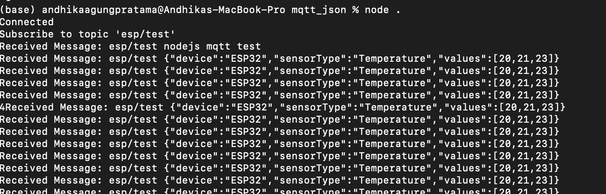
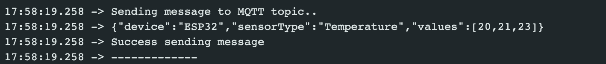
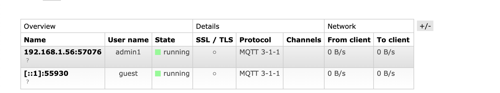
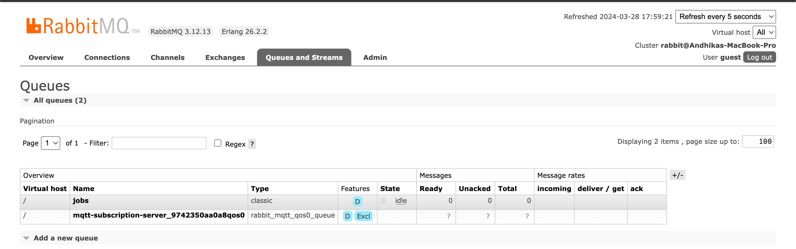

# MQTT for JSON Data

This repository is made for learning to connect MQTT with ESP 32 and Node JS. Then send data from ESP 32 to MQTT using JSON.

## How To Use?
1. Setup the broker in this case I use localhost broker which is RabbitMQ
   - [RabbitMQ Installation](https://www.rabbitmq.com/docs/download)
   - [RabbitMQ using MQTT plugin](https://www.rabbitmq.com/docs/mqtt)
2. Then we need to add some library in Arduino IDE
   - ArduinoJson by Benoit Blanchon | Version 5.13.5 | make sure it's version 5
   - PubSubClient by Nick O'Leary | Version 2.7.0
3. You need to have NodeJS installed on your computer and make sure you also have npm installed
4. Pull this Repo and do "npm install"
5. Then do "node ." to start NodeJS server
6. In the MQTT_JSON.ino file, you need to set the server to your localhost IP address and the port
7. Don't forget to set the username and password of your RabbitMQ broker
8. Don't forget to change the SSID and password of the wifi
9. Upload the code to your ESP32
 
## Results
1. Node JS Server Response
   
   This is the response of your NodeJS Server if you are already connected and if you get the message.
2. Serial Monitor Log
   
   This is the view in your serial monitor if you sending the data.
3. List of Connections in RabbitMQ Dashboard
   
   This is the list of the connections that connect to your broker. 1 for your ESP32 and 1 for your NodeJS Server.
4. List of Queues in RabbitMQ Dashboard
   
   New Queues in RabbitMQ will be made and can be seen in the dashboard.

 ## What's Next?
 The next thing that you need is to parse the JSON data and connect the server with the databases and keep the data in your database.

 == Good Luck for trying this. ==
